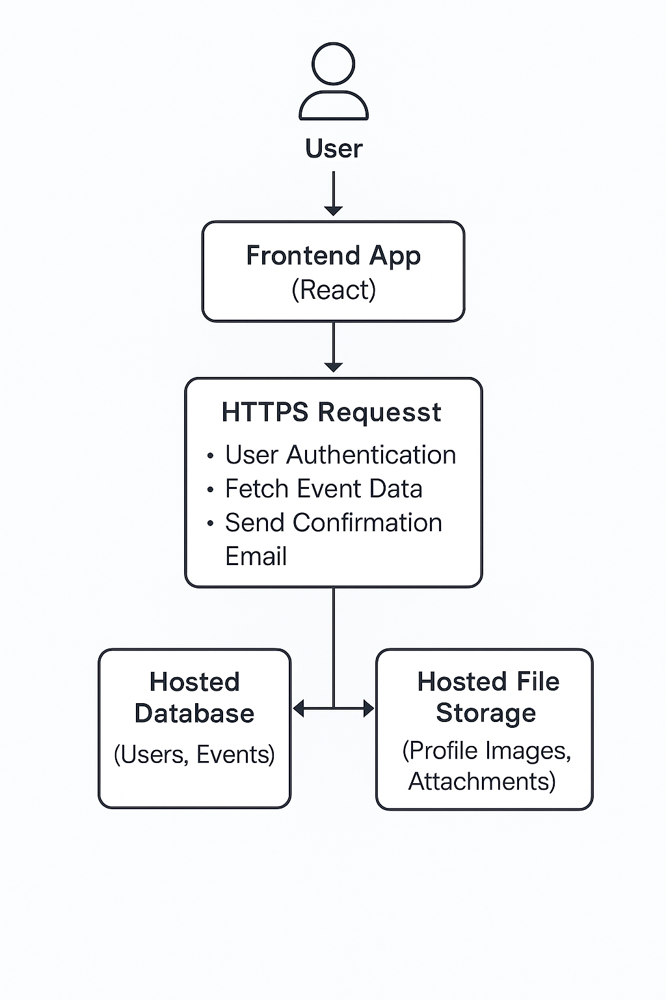

# Meet App


[](https://meet-rouge.vercel.app/)

**Meet** is a social app where users can view events happening all around them and where they can look at event details and determine which events they want to attend.

## Table of Contents

- [About the App](#about-the-app)
- [User Stories](#user-stories)
- [Features](#features)
- [Installation](#installation)
- [Usage](#usage)
- [Technologies Used](#technologies-used)
- [License](#license)

## About the App

Meet is a progressive web application (PWA) that provides users with a list of events happening in various cities. Users can filter events, view more details, set the number of events displayed, and even access the app offline.

## User Stories

- **Filter Events by Cities**  
  _As a user, I should be able to filter events by city, so that I can quickly find events happening in my preferred location._

- **Show/Hide Event Details**  
  _As a user, I should be able to show or hide event details, so that I can view more information only when needed and keep the interface clean and organized._

- **Specify Number of Events**  
  _As a user, I should be able to specify the number of events displayed, so that I can control the amount of information shown based on my preference._

- **Use the App Offline**  
  _As a user, I should be able to use the app while offline, so that I can access event information even without an internet connection._

- **Add an App Shortcut to the Home Screen**  
  _As a user, I should be able to add the app as a shortcut to my home screen, so that I can quickly access it like a native mobile app._

- **Display Charts Visualizing Event Details**  
  _As a user, I should be able to view charts that visualize event data, so that I can better understand event trends and statistics at a glance._

## Features

- Filter events by city
- Show/hide event details
- Set the number of events displayed
- Work offline with cached event data
- Add the app to the home screen
- Visualize event data with interactive charts

## Installation

1. Clone the repository:
   ```bash
   git clone https://github.com/tmoubre/Meet.git
   ```
2. Navigate to the project directory:
   ```bash
   cd Meet
   ```
3. Install dependencies:
   ```bash
   npm install
   ```
4. Start the application:
   ```bash
   npm run dev
   ```

## Usage

- Open the app to view a list of upcoming events.
- Filter events by selecting a city from the search bar.
- Click on an event to show or hide its details.
- Adjust the number of events displayed using the settings input.
- Add the app to your home screen for easy access.
- Visualize event data trends through charts.

## Technologies Used

- [React](https://react.dev/)
- [Vite](https://vitejs.dev/)
- [Recharts](https://recharts.org/) (for data visualizations)
- [Google Calendar API](https://developers.google.com/calendar)
- [Jest](https://jestjs.io/) & [Puppeteer](https://pptr.dev/) (for testing)
- [Workbox](https://developer.chrome.com/docs/workbox/) (for offline functionality)
- [Progressive Web App (PWA)](https://web.dev/progressive-web-apps/)

## Serverless Architecture Diagram



The Meet App follows a serverless architecture. The React frontend communicates with serverless functions via HTTPS. These functions handle user authentication, event data fetching, and sending email confirmations. Serverless functions interact with a hosted database and hosted file storage. This design ensures scalability, cost-efficiency, and minimal server maintenance.

## License

This project is licensed under the [MIT License](https://opensource.org/licenses/MIT).

# React + Vite

This template provides a minimal setup to get React working in Vite with HMR and some ESLint rules.

Currently, two official plugins are available:

- [@vitejs/plugin-react](https://github.com/vitejs/vite-plugin-react/blob/main/packages/plugin-react/README.md) uses [Babel](https://babeljs.io/) for Fast Refresh
- [@vitejs/plugin-react-swc](https://github.com/vitejs/vite-plugin-react-swc) uses [SWC](https://swc.rs/) for Fast Refresh
...

## Features

- Filter events by city
- Show/hide event details
- Set the number of events displayed
- Work offline with cached event data
- Add the app to the home screen
- Visualize event data with interactive charts

## Testing

Testing in the Meet App is implemented using **Jest**, **React Testing Library**, **Puppeteer**, and **jest-cucumber** to ensure robust test coverage across all user-facing features.

### ✅ Unit and Integration Testing

- **Event Component**
  - Renders correctly with mock data
  - Expands and collapses details on interaction
- **CitySearch Component**
  - Displays location suggestions based on input
  - Filters events by city selection
- **NumberOfEvents Component**
  - Handles user input to change event count
  - Updates event list accordingly
- **App Component**
  - Integrates all subcomponents
  - Displays filtered and limited event lists

### ✅ Behavior-Driven Development (BDD)

BDD-style tests written with [`jest-cucumber`](https://github.com/bencompton/jest-cucumber) match user stories directly to test scenarios.

#### Feature: Show/Hide Event Details
- Verifies events are collapsed by default
- Expands to show details on click
- Collapses again on second click

#### Feature: Specify Number of Events
- User can input desired number of events
- App updates displayed event list dynamically

#### Feature: Filter Events by City
- User types a city and sees suggestions
- Selecting a suggestion filters the event list

### ✅ End-to-End Testing

- Full integration test validates:
  - City filtering
  - Event detail toggling
  - Custom number of events
  - Interaction with multiple components together

Test files include:
- `src/__tests__/App.test.js`
- `src/__tests__/CitySearch.test.js`
- `src/__tests__/EventList.test.js`
- `src/__tests__/Event.test.js`
- `src/__tests__/NumberOfEvents.test.js`
- `src/__tests__/EndToEnd.test.js`
- `src/features/showHideAnEventsDetails.test.js`
- `src/features/specifyNumberOfEvents.test.js`
- `src/features/filterEventsByCity.test.js`

...

